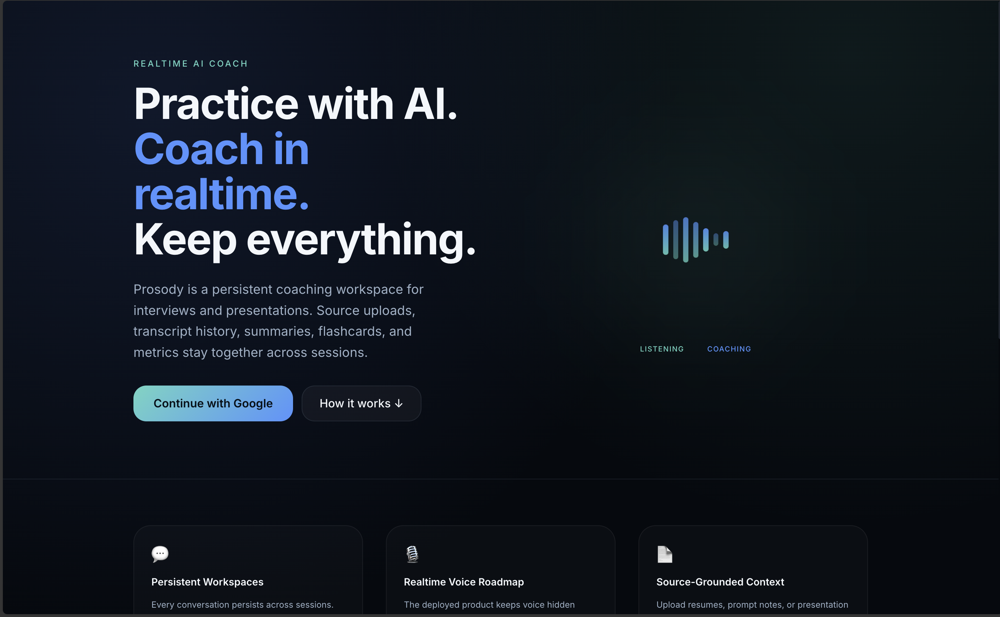
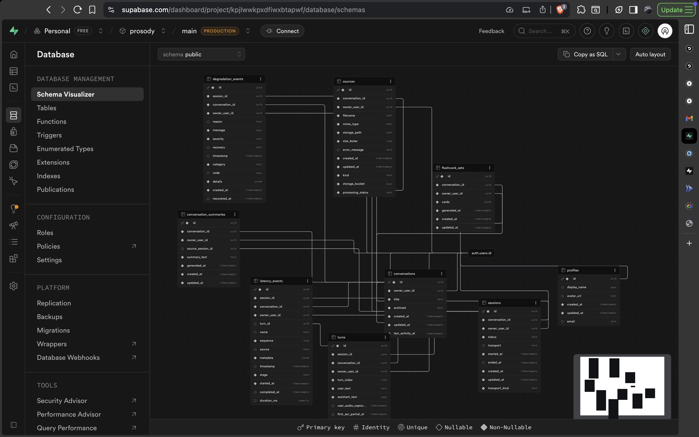
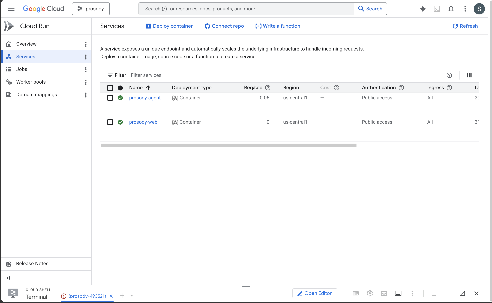
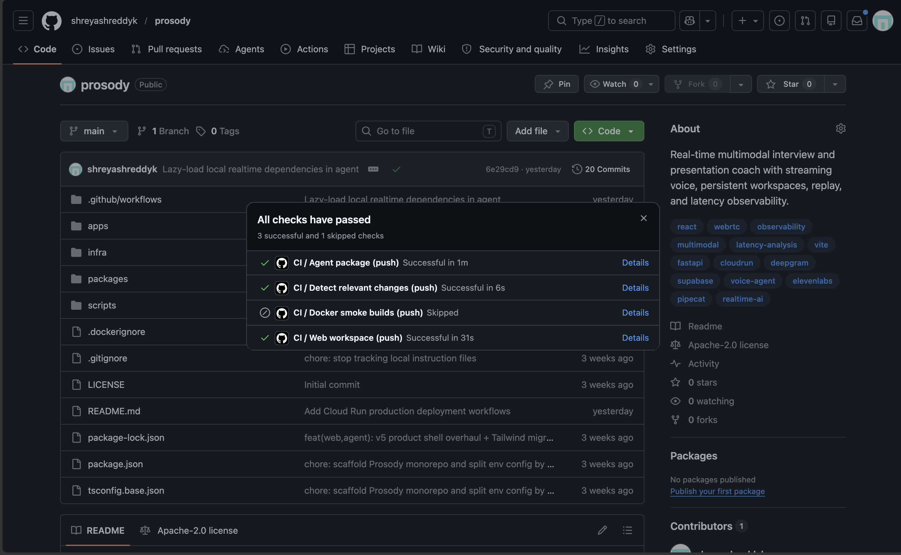

# Prosody

<p align="center">
  <strong>Production-minded AI interview and presentation coaching workspace</strong>
</p>

<p align="center">
  <a href="#product-preview"></a>
  <a href="#architecture"></a>
  <a href="#persistence-model"></a>
  <a href="#cicd"></a>
  <a href="#operational-runbook"></a>
  <a href="infra/cloudrun/README.md"></a>
</p>

<p align="center">
  
  
  
  
  
  
  
  
</p>

Prosody is a deployed, production-minded AI coaching workspace for interview and presentation practice. It combines an authenticated React product shell with a FastAPI agent service, Supabase-backed persistence, source uploads, transcript history, summaries, flashcards, metrics, and Cloud Run deployment automation.

The current public production surface is intentionally scoped and honest: the durable workspace, uploads, history, generation, metrics, and operational endpoints are deployable today. The local Pipecat `SmallWebRTCTransport` voice loop is preserved for development and diagnostics, but it is not exposed as the public production transport.

## Product Preview



Prosody is built around persistent coaching workspaces. A **Conversation** is the long-lived notebook; a **Session** is one live call inside that conversation; a **Turn** is one user utterance plus one assistant response; a **Source** is an uploaded context asset such as a resume, job description, notes, or presentation material.

## Current Production Surface

- Authenticated web app with Supabase Auth and Google OAuth.
- Persistent conversations, session history, transcript turns, source metadata, summaries, flashcards, degradation events, and latency metrics in Supabase Postgres.
- Browser source uploads to Supabase Storage using the private `conversation-sources` bucket pattern.
- FastAPI agent endpoints for health, readiness, metadata, summaries, flashcards, and authenticated session/debug reads.
- Cloud Run deployment split into separate web and agent services.
- GitHub Actions CI for JS workspaces, Python agent checks, tests, and path-filtered Docker smoke builds.
- Manual production CD through GitHub Actions, GitHub Environments, Workload Identity Federation, Artifact Registry, Cloud Run, and Secret Manager.

## Architecture

```text
Browser
  |
  | serves static app / calls APIs with Supabase bearer token
  v
prosody-web (Cloud Run, nginx + Vite/React)
  |
  +--> Supabase Auth (Google OAuth, browser anon key)
  +--> Supabase Postgres (conversations, sessions, turns, summaries, flashcards, metrics)
  +--> Supabase Storage (conversation source uploads)
  |
  +--> prosody-agent (Cloud Run, FastAPI + uvicorn)
         |
         +--> Supabase JWT validation and service-role persistence
         +--> OpenAI-backed summary and flashcard generation
         +--> health/readiness/meta endpoints
         +--> gated local/dev SmallWebRTC lifecycle routes
```

### Deployed Service Split

- `prosody-web`: React + Vite + TypeScript app built into static assets and served by nginx with SPA fallback. Vite `VITE_*` values are baked into the image at build time.
- `prosody-agent`: Python 3.12 FastAPI service running on Cloud Run's `$PORT` through uvicorn. It owns server-only provider credentials, Supabase service-role access, authenticated generation APIs, readiness checks, and the gated local realtime session surface.

## Persistence Model



This schema view is worth including because it makes the product's persistence layer concrete. Prosody is not just a stateless prompt demo: conversations, sessions, turns, sources, summaries, flashcards, latency events, degradation events, and profiles are modeled as durable records tied back to Supabase Auth users. That structure supports resumable workspaces, source-grounded coaching artifacts, user-scoped data isolation, and observability/replay workflows that can be inspected after a session ends.

The important design signal is ownership and traceability. User-facing objects flow from `profiles` and `conversations` into session history, uploaded sources, generated study artifacts, and timing/degradation telemetry, while the agent service uses server-side Supabase access only after validating the user's bearer token and checking conversation/session ownership.

## Stack

| Layer | Technology |
| --- | --- |
| Frontend | React, Vite, TypeScript |
| Backend | Python, FastAPI, Pipecat-ready module boundaries |
| Auth | Supabase Auth with Google OAuth |
| Persistence | Supabase Postgres |
| File storage | Supabase Storage |
| Generation | OpenAI for summaries and flashcards |
| Local realtime | Pipecat `SmallWebRTCTransport` |
| Future deployed realtime | `DailyTransport` or equivalent production transport |
| Deployment | Google Cloud Run, Artifact Registry, Secret Manager |
| CI/CD | GitHub Actions with Workload Identity Federation |

## Realtime Transport Status

Realtime voice is deliberately feature-gated in this release.

- Local/dev voice path: Pipecat `SmallWebRTCTransport`, Deepgram Flux STT, OpenAI LLM, and ElevenLabs streaming TTS.
- Production Cloud Run posture: voice controls remain hidden when `VITE_ENABLE_LIVE_VOICE=0`, and agent local realtime mutation/signaling routes reject calls when `ENABLE_LOCAL_SMALLWEBRTC=0`.
- Known limitation: the current local `SmallWebRTCTransport` voice path is not the public production transport. It should not be presented as the deployed realtime experience until `DailyTransport` or another production-ready transport is integrated.

The deployed app can still support login, uploads, persistent workspaces, transcript/history review, summaries, flashcards, metrics reads, health checks, and metadata checks while voice is disabled.

## Repository Layout

- `apps/web`: authenticated React product shell with conversations, sessions, sources, history, summaries, flashcards, metrics, and gated live voice controls
- `apps/agent`: FastAPI service with health/meta endpoints, authenticated generation APIs, Supabase-backed persistence, and gated local realtime routes
- `packages/contracts`: shared TypeScript contracts for product entities and realtime events
- `packages/ui`: shared React presentation primitives
- `infra/cloudrun`: Cloud Run build, deploy, environment, rollback, and operations notes
- `infra/supabase`: Supabase schema, migration, and storage notes
- `docs`: local-only learning trail and decision record; intentionally ignored by Git
- `artifacts/readme`: committed portfolio artifacts referenced by this README

## Local Development

Install JS dependencies:

```bash
npm install
```

Start the web app:

```bash
npm run dev:web
```

Create a Python virtual environment and install the agent package:

```bash
python3 -m venv .venv
.venv/bin/pip install -e apps/agent
```

Start the agent:

```bash
npm run dev:agent
```

To exercise the local realtime voice path, explicitly enable both sides in local env files only:

```bash
# apps/web/.env.local
VITE_ENABLE_LIVE_VOICE=1

# apps/agent/.env
ENABLE_LOCAL_SMALLWEBRTC=1
```

Production Cloud Run deployments should leave both flags unset or set to `0`.

## Environment Boundaries

- Web env: `apps/web/.env.local` for browser-visible `VITE_*` values only.
- Agent env: `apps/agent/.env` for server runtime settings and secrets.
- Cloud Run web build args: `VITE_AGENT_BASE_URL`, `VITE_SUPABASE_URL`, `VITE_SUPABASE_ANON_KEY`, `VITE_ENABLE_LIVE_VOICE`, and `VITE_ENABLE_UI_DEMO_TOOLS`.
- Cloud Run agent runtime env: `WEB_ALLOWED_ORIGINS`, `SUPABASE_URL`, `AGENT_LOG_LEVEL`, `LLM_PROVIDER`, `LLM_MODEL`, and `ENABLE_LOCAL_SMALLWEBRTC`.
- Cloud Run agent secrets: Supabase service-role/JWT credentials and provider keys are supplied through Google Secret Manager references.

The Supabase anon key is browser-safe by design. Supabase service-role keys, JWT secrets, OpenAI, Deepgram, ElevenLabs, and Daily credentials stay server-only.

## Health And Readiness

The web container exposes a simple static-server health endpoint:

```bash
curl -i https://<web-service>/healthz
```

The agent exposes:

```bash
curl -i https://<agent-service>/health/live
curl -i https://<agent-service>/health/ready
curl -i https://<agent-service>/meta
```

Expected production metadata includes:

```json
{
  "local_smallwebrtc_enabled": false,
  "realtime_status": "production_realtime_disabled"
}
```

`/health/live` verifies the process is alive. `/health/ready` reports `ok` when Supabase is either not configured or both JWKS and REST checks are reachable; it reports `degraded` when Supabase is configured but unreachable. `/meta` exposes provider configuration state, Supabase connectivity state, intended local/deployed transports, and the active realtime posture.

## CI/CD

### Continuous Integration

`.github/workflows/ci.yml` runs on pull requests and pushes. It:

- installs npm workspace dependencies with Node 20 and `npm ci`
- typechecks and builds all JS workspaces
- runs the web Vitest suite when present
- installs the Python agent package with Python 3.12
- compiles `apps/agent/app`
- runs agent pytest tests when present
- smoke-builds the web and agent Docker images when Docker-relevant paths change

Docker smoke builds validate image construction with safe placeholder web build args. They do not publish images, deploy services, or require production secrets.

### Continuous Deployment

Production deployment is manual and environment-gated:

- `.github/workflows/deploy-web.yml` builds and pushes `prosody-web`, then deploys the configured web Cloud Run service.
- `.github/workflows/deploy-agent.yml` builds and pushes `prosody-agent`, then deploys the configured agent Cloud Run service with Secret Manager-backed runtime secrets.

Both workflows use GitHub Actions Workload Identity Federation for Google Cloud auth and the GitHub `production` Environment for deliberate release control. The detailed setup, one-time GCP resources, GitHub Environment variables, bootstrap ordering, rollback commands, and Cloud Run gotchas live in [infra/cloudrun/README.md](infra/cloudrun/README.md).

The first production bootstrap has a URL dependency loop: the web image needs the agent URL at build time, and the agent needs the final web origin for CORS. Deploy the agent with a temporary origin, deploy the web with the agent URL, then redeploy the agent with the final web origin in `WEB_ALLOWED_ORIGINS`.

### Deployment Evidence

These screenshots are included deliberately as lightweight release evidence. They help a reviewer see that Prosody has moved beyond local-only scaffolding into separate Cloud Run services and a checked GitHub Actions workflow, without claiming a fresh live health check for the current revision.





## Operational Runbook

### Verify Health

1. Check the web static server:

```bash
curl -i https://<web-service>/healthz
```

2. Check the agent process:

```bash
curl -i https://<agent-service>/health/live
```

3. Check agent readiness:

```bash
curl -i https://<agent-service>/health/ready
```

4. Check the production realtime posture:

```bash
curl -i https://<agent-service>/meta
```

For Cloud Run, `/meta` should show `local_smallwebrtc_enabled: false` and `realtime_status: "production_realtime_disabled"`.

### Verify Supabase Connectivity

Use `/health/ready` and `/meta` together.

- `ready.status = "ok"`: the agent can reach the required Supabase checks, or Supabase is intentionally not configured for that environment.
- `ready.status = "degraded"` with Supabase configured: check `SUPABASE_URL`, Secret Manager references, enabled secret versions, runtime service account access, Supabase JWKS reachability, and Supabase PostgREST reachability.
- `/meta.supabase.jwks_reachable` and `/meta.supabase.rest_reachable` help distinguish auth-key discovery from database API connectivity.

### Verify CORS Config

The browser calls the agent directly, so `WEB_ALLOWED_ORIGINS` must exactly include the deployed web origin.

```bash
curl -i \
  -X OPTIONS \
  -H "Origin: https://<web-service>" \
  -H "Access-Control-Request-Method: POST" \
  https://<agent-service>/api/conversations/<conversation-id>/summary
```

If login and uploads work but agent calls fail in the browser, check Cloud Run `WEB_ALLOWED_ORIGINS`, rebuild/redeploy ordering, and whether the web image was built with the intended `VITE_AGENT_BASE_URL`.

### When Login And Uploads Work But Voice Is Disabled

That can be the correct production posture. Check:

- `VITE_ENABLE_LIVE_VOICE` in the web build. Production should be `0`.
- `ENABLE_LOCAL_SMALLWEBRTC` in the agent runtime env. Production should be `0`.
- `/meta.realtime_status`. Production should be `production_realtime_disabled`.
- Whether the user is expecting local/dev voice instead of the deployed product. Local voice requires both flags set to `1` and local provider credentials.
- Whether future production voice work has integrated `DailyTransport`; until then, do not enable the local SmallWebRTC path for public Cloud Run traffic.

### Cloud Run Startup Triage

If Cloud Run reports that a container failed to listen on `$PORT`, inspect revision logs before assuming a port issue:

```bash
gcloud logging read \
  'resource.type="cloud_run_revision" AND resource.labels.service_name="<service-name>"' \
  --project "<project-id>" \
  --limit 100 \
  --format='table(timestamp,severity,textPayload)'
```

Past production hardening found that disabled local realtime imports could still load native WebRTC/OpenCV dependencies during agent startup. The agent now lazy-loads local realtime modules so the production-disabled path does not block Cloud Run startup.

## Validation

Useful local checks:

```bash
npm run typecheck
npm run build
npm run test --workspace @prosody/web --if-present
python3 -m compileall apps/agent/app
python3 -m pytest apps/agent/tests
```

Useful deployment checks:

```bash
curl -i https://<web-service>/healthz
curl -i https://<agent-service>/health/live
curl -i https://<agent-service>/health/ready
curl -i https://<agent-service>/meta
```

Do not treat these commands as evidence of a fresh deployment unless they are run against the deployed Cloud Run services for the specific revision being evaluated.

## Productionization Surface

Prosody now demonstrates more than a local prototype:

- deployable Cloud Run containers for web and agent
- environment-separated browser and server configuration
- Supabase Auth, Postgres, and Storage integration
- server-side JWT validation and service-role persistence boundary
- source-grounded summary and flashcard generation
- latency, timeline, degradation, and replay-oriented data model
- CI validation across TypeScript, Python, tests, and Docker image buildability
- manual production CD with Workload Identity Federation and Secret Manager
- operational runbook for health, Supabase readiness, CORS, voice gating, and Cloud Run startup triage

The key known limitation is also explicit: public production realtime voice is not enabled in this release. The current local SmallWebRTC path remains a development and diagnostics asset until a production transport such as DailyTransport is integrated.
